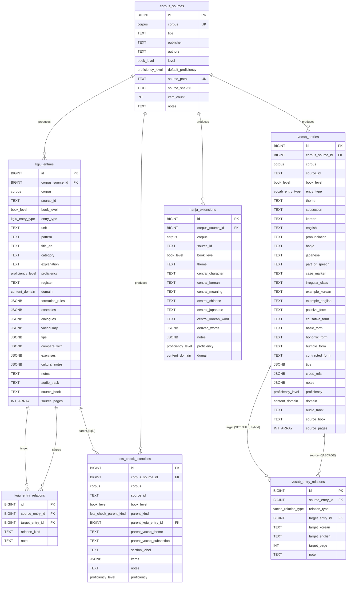

# ERD — Darakwon corpora (migration 002)

Source: `Repository/db/migrations/002_darakwon_corpora.up.sql`.
Sibling ADRs: `ADR-001-database-choices.md`, `ADR-005-stable-cols-vs-jsonb.md`,
`ADR-006-tsvector-language-config.md`, `ADR-007-vocab-relations-hybrid-target.md`,
`ADR-008-kgiu-vs-grammar-entries.md`.

## Naming clarification

There are TWO grammar tables in this schema, distinct on purpose:

- **`grammar_entries`** — A1's table from `001_core_schema`. User-canonical
  grammar bank, FK to `users`, dedupes highlights by `(user_id, pattern_key)`,
  feeds SRS production drills.
- **`kgiu_entries`** — Owned by this migration. Raw KGIU-book source rows,
  one per `kgiu-<level>-…` JSON entry.

Phase C will build the bridge: a user-canonical `grammar_entries` row will
point at one or more `kgiu_entries` rows (and at TTMIK/Iyagi rows once those
land). See `ADR-008-kgiu-vs-grammar-entries.md`.

## Tables created by migration 002

| Table | Rows about | PK | Audit cols |
|---|---|---|---|
| `corpus_sources` | One per ingested JSON file | `id BIGINT IDENTITY` | yes |
| `kgiu_entries` | One per KGIU source-JSON entry (all 3 levels unified) | `id` | yes |
| `kgiu_entry_relations` | Directed FK cross-references between `kgiu_entries` rows | `id` | yes |
| `vocab_entries` | One per 2000-Words entry (Beginner + Intermediate) | `id` | yes |
| `vocab_entry_relations` | Hybrid-target word↔word relations | `id` | yes |
| `hanja_extensions` | "Korean through Chinese Characters" mind-maps | `id` | yes |
| `lets_check_exercises` | Review-exercise pages, polymorphic parent | `id` | yes |

## Enums introduced by migration 002

- `content_domain` — `general` / `research` / `business`
- `vocab_relation_type` — `synonym`, `antonym`, `related`, `reference`, `passive_form`, `causative_form`, `basic_form`, `honorific_form`, `humble_form`, `contracted_form`
- `kgiu_entry_type` — `grammar` / `intro`
- `vocab_entry_type` — `word` / `theme_intro` / `subsection_intro`
- `lets_check_parent_kind` — `kgiu_entry` / `vocab_subsection`

Reused from A1 / 001: `proficiency_level`, `corpus`, `book_level`, `register_level`.
Reused trigger function: `set_updated_at()`.

## Mermaid

## Cardinality / referential integrity notes

| Edge | ON DELETE | ON UPDATE | Why |
|---|---|---|---|
| `corpus_sources(id) ← kgiu_entries.corpus_source_id` | RESTRICT | CASCADE | Reference data — can't delete a source while children exist. |
| `corpus_sources(id) ← vocab_entries.corpus_source_id` | RESTRICT | CASCADE | Same. |
| `corpus_sources(id) ← hanja_extensions.corpus_source_id` | RESTRICT | CASCADE | Same. |
| `corpus_sources(id) ← lets_check_exercises.corpus_source_id` | RESTRICT | CASCADE | Same. |
| `kgiu_entries(id) ← kgiu_entry_relations.source_entry_id` | RESTRICT | CASCADE | Deleting a referenced entry must be deliberate. |
| `kgiu_entries(id) ← kgiu_entry_relations.target_entry_id` | RESTRICT | CASCADE | Same. |
| `kgiu_entries(id) ← lets_check_exercises.parent_kgiu_entry_id` | CASCADE | CASCADE | Exercises belong to their parent entry. |
| `vocab_entries(id) ← vocab_entry_relations.source_entry_id` | CASCADE | CASCADE | Relation has no meaning without its source. |
| `vocab_entries(id) ← vocab_entry_relations.target_entry_id` | SET NULL | CASCADE | Preserve text label if FK target goes away (ADR-007). |

## FTS / GIN indexes — REMOVED (migration 091_fts_removal, audit §4.2)

The `search_tsv` tsvector columns, their GIN indexes
(`ix_kgiu_entries_search_tsv`, `ix_vocab_entries_search_tsv`), and the
maintenance triggers (`trg_kgiu_entries_tsv`, `trg_vocab_entries_tsv`) were
removed — the full-text-search subsystem had no live query callers (see the
superseding notes in ADR-006 / ADR-015). Reference/vocab/grammar search uses
substring/prefix (ILIKE) matching instead.

## Composite uniqueness

- `(corpus, source_id)` is the natural key on `kgiu_entries`, `vocab_entries`, `hanja_extensions`, `lets_check_exercises`. Loader upserts on it.
- `corpus` on `corpus_sources` is unique.
